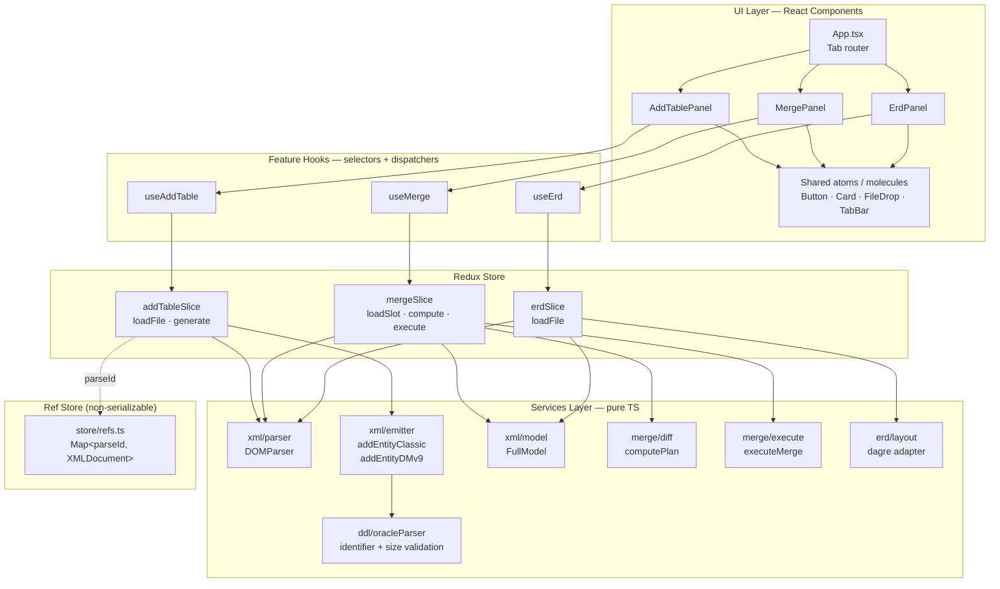
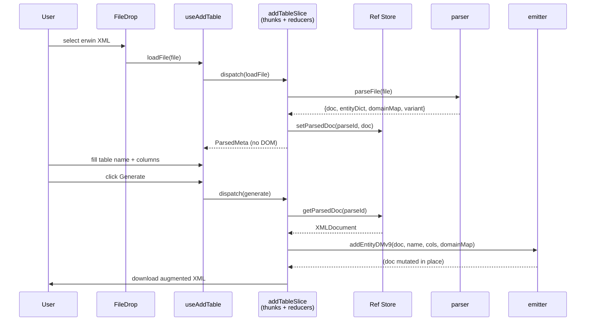

# Erwin Data Modeller — Lite

A browser-based companion for [erwin Data Modeler](https://www.erwin.com/products/erwin-data-modeler/) exports. Upload an erwin XML file, add or merge entities, and visualise the ER diagram — all client-side, without installing a full erwin licence.

> Supports **classic erwin** and **erwin DM 9.x** (`erwin_Repository`, `EMX:` namespace) XML exports.

---

## Features

| Tab              | What it does                                                                                                      |
| ---------------- | ----------------------------------------------------------------------------------------------------------------- |
| **Add Tables**   | Parse an erwin XML file, add a new entity with typed columns, PK flags, and Oracle-compatible validation, then download the augmented XML. |
| **Merge Models** | Load two DM 9.x files as **source** and **target**, diff them (missing tables, missing columns, conflicts), stage changes with an arrow-driven picker, and execute the merge into a fresh target XML with a report. |
| **ERD Diagram**  | Auto-layout the model with `dagre`, render an interactive SVG ERD with pan, zoom, and hover-to-highlight relationships. |

---

## Tech Stack

- **React 18** + **TypeScript** (strict mode, `noUnusedLocals`, `noUnusedParameters`)
- **Vite 5** for dev server + build
- **Redux Toolkit 2** + **react-redux 9** for state management
- **Sass (SCSS modules)** for styling
- **@dagrejs/dagre** for graph layout
- **DOMParser / XMLSerializer** (native browser APIs) for XML I/O — no runtime parsing dependencies

---

## Architecture

The app is a thin React UI over three feature domains. Each feature owns a Redux slice and a services layer; components never touch XML directly.



### Data flow — Add Tables (representative)



### Why a ref store?

erwin XML is mutated **in place** by the emitter (`addEntityDMv9`) so that subsequent edits roll forward without losing formatting. But Redux state is frozen by Immer on every dispatch, which would break in-place DOM mutation on the second edit.

The fix: keep the `XMLDocument` instance in a module-scoped `Map<parseId, XMLDocument>` ([src/store/refs.ts](src/store/refs.ts)) and let Redux hold only the serializable metadata (filename, variant, entity dictionary as a `Map<string,string>`, domain map). Immer's `enableMapSet()` lets the `Map` values live inside slice state safely.

---

## Project Structure

```
src/
├── App.tsx                   # tab router
├── main.tsx                  # React root — Provider + enableMapSet
├── CONSTANTS/                # i18n strings for every tab
├── store/
│   ├── index.ts              # configureStore + typed hooks
│   └── refs.ts               # XMLDocument ref store
├── features/
│   ├── addTable/
│   │   ├── addTableSlice.ts  # loadFile + generate thunks
│   │   ├── useAddTable.ts    # hook wrapper
│   │   └── validation.ts     # table-name + column validation
│   ├── merge/
│   │   ├── mergeSlice.ts     # loadSlot thunk + compute/execute reducers
│   │   └── useMerge.ts
│   └── erd/
│       ├── erdSlice.ts       # loadFile thunk
│       ├── useErd.ts
│       └── layout.ts         # dagre adapter
├── services/
│   ├── ddl/oracleParser.ts   # Oracle identifier + size/scale rules
│   └── xml/
│       ├── parser.ts         # DOMParser + variant detection
│       ├── emitter.ts        # addEntityClassic, addEntityDMv9
│       ├── serialize.ts      # XMLSerializer + output filename
│       ├── model.ts          # FullModel projection
│       ├── namespaces.ts     # dm / emx namespace URIs
│       ├── relationships.ts  # DM 9.x Relationship extraction
│       └── merge/
│           ├── diff.ts       # computePlan
│           ├── execute.ts    # executeMerge (fresh-parse target)
│           └── types.ts
├── components/
│   ├── atoms/                # Button, Card, Input, Badge, Textarea
│   ├── molecules/            # FileDrop, Field, StatTile, TabBar, EmptyState
│   └── organisms/            # AddTablePanel, MergePanel, ErdPanel
├── layout/                   # AppShell, TopBar, Footer
└── styles/                   # SCSS tokens, resets, mixins
```

---

## Getting Started

### Prerequisites

- **Node.js** 18 or newer
- **npm** 9 or newer

### Install

```bash
npm install
```

### Run the dev server

```bash
npm run dev
```

Vite serves on `http://localhost:5173` by default.

### Type-check

```bash
npm run typecheck
```

### Production build

```bash
npm run build
npm run preview    # serve the built assets locally
```

---

## Supported XML Variants

The parser auto-detects which variant you uploaded:

| Variant         | Detection rule                                                       | Features supported            |
| --------------- | -------------------------------------------------------------------- | ----------------------------- |
| `erwin-dm-v9`   | Root `<erwin>` with `Format="erwin_Repository"` and `EMX:` namespace | Add Tables, Merge, ERD        |
| `erwin-classic` | Root has non-EMX `<Entity>` children                                 | Add Tables only               |
| `unknown`       | Neither pattern matches                                              | Rejected with a parse error   |

**Merge** and **ERD Diagram** require `erwin-dm-v9` because they rely on `EMX:Domain`, `EMX:AttributeProps`, and `EMX:Relationship` nodes that only exist in the DM 9.x schema.

---

## Design Notes

- **Client-side only.** No server, no backend, no telemetry. The file never leaves the browser — `parseFile` reads it with the File API and all mutation happens on an in-memory `XMLDocument`.
- **Atomic design.** Components are split into atoms (primitive UI), molecules (composed primitives), and organisms (feature panels). Feature logic lives in the `features/` tree, not in components.
- **Pure services.** Everything under `services/` is framework-agnostic TypeScript — no React, no Redux. This keeps the XML/DDL logic independently testable and reusable.
- **Strict validation.** `services/ddl/oracleParser.ts` enforces Oracle's identifier rules (length, quoting, reserved words) and numeric size/scale rules before any XML is emitted.
- **No source-GUID reuse.** When merging, `executeMerge` mints fresh GUIDs for every copied attribute and resolves domain references by name against the target's library. The source is never trusted for identity.

---

## License

Unlicensed / internal. Contact the repository owner for use.
