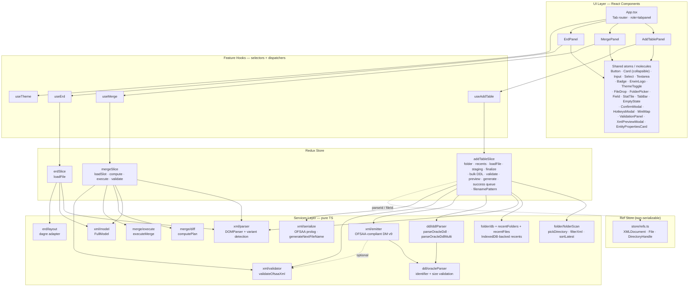
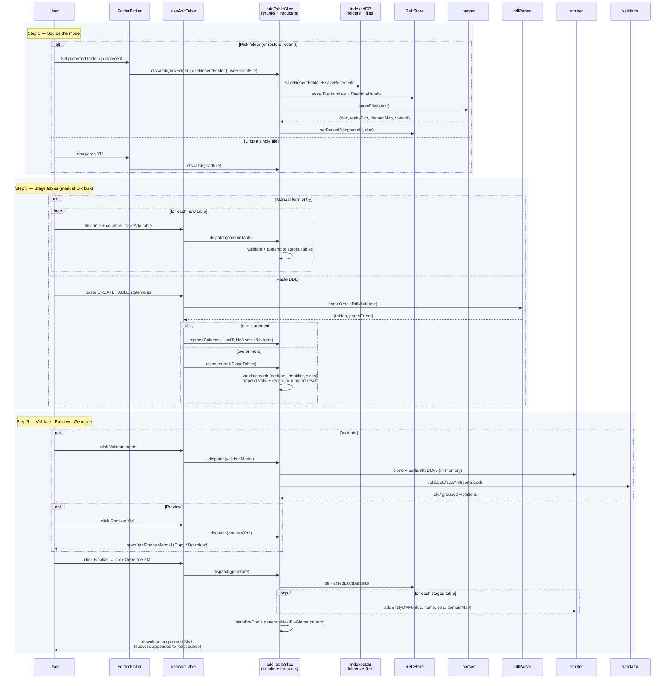
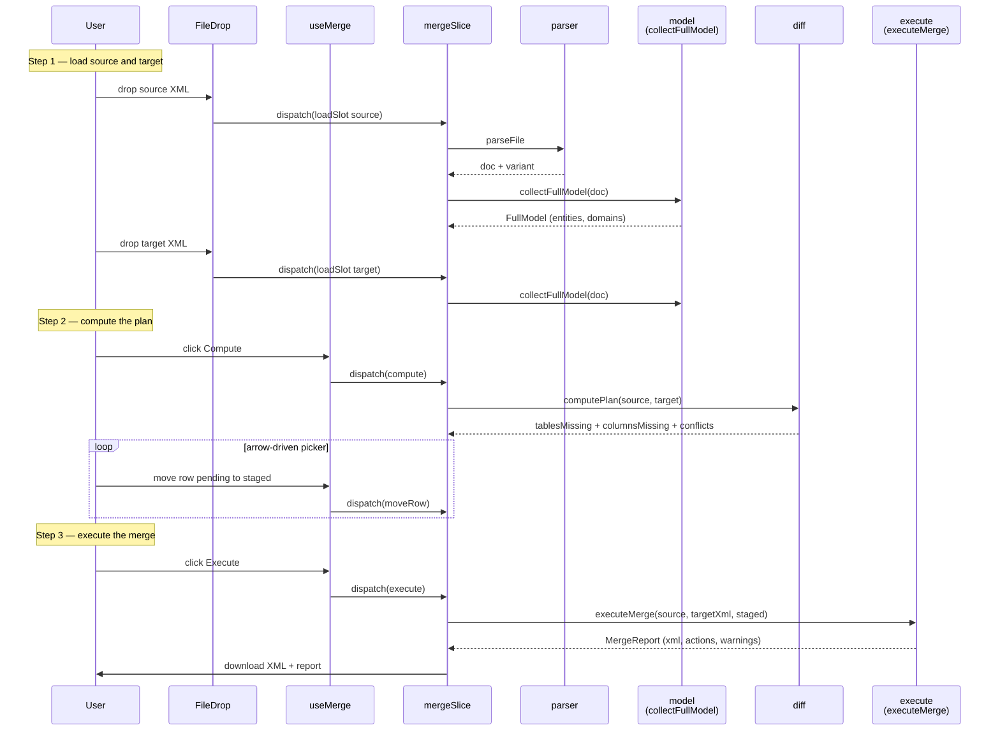
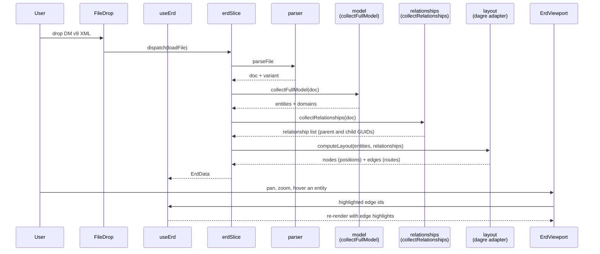

# Erwin Data Modeller — Lite

A browser-based companion for [erwin Data Modeler](https://www.erwin.com/products/erwin-data-modeler/) exports. Pick a folder, add or merge entities, and visualise the ER diagram — all client-side, with **OFSAA-compliant** XML generation, no server, no upload, no licence required.

> Supports **classic erwin** and **erwin DM 9.x** (`erwin_Repository`, `EMX:` namespace) XML exports.

---

## Features

| Tab              | What it does                                                                                                      |
| ---------------- | ----------------------------------------------------------------------------------------------------------------- |
| **Add Tables**   | Pick a **preferred folder** (FS Access API on Chrome/Edge, `<input webkitdirectory>` elsewhere) and the latest `.xml` auto-loads. **Recent folders** and **recent files** persist to IndexedDB across sessions. Queue multiple tables manually with strict Oracle identifier validation, or **paste one or many `CREATE TABLE` statements** — single paste fills the form, two-or-more bulk-imports with per-table validation. **Drag-or-keyboard reordering** of columns, **click any existing entity** to inspect its full column list (Column / Type / Nullable / PK / FK), **validate** the model against OFSAA rules without generating, **preview** the would-be XML, **configurable filename pattern** (sequential `v1` / zero-padded `v01` / ISO `date`), then download. Toast queue for rapid generates. |
| **Merge Models** | Load two DM 9.x files as **source** and **target**, diff them (missing tables, missing columns, conflicts), stage changes with an arrow-driven picker, execute the merge into a fresh target XML, and **validate the merged output** before download. |
| **ERD Diagram**  | Auto-layout the model with `dagre`; render an interactive SVG ERD with pan, zoom, hover-to-highlight relationships, and click-to-inspect columns. **Search** entities (debounced; non-matches dim). **Minimap** with a draggable viewport rectangle. Full **keyboard navigation**: `Tab` cycles entities, `+`/`-` zoom, `0` fits, arrows pan (`Shift+arrows` for larger steps). Minimap auto-hides on mobile. |

### App-wide ergonomics

- **Light / dark theme toggle**, with `prefers-color-scheme` default and localStorage persistence.
- **Hotkeys modal** (`?`) lists every keyboard shortcut.
- **WCAG 2.1 AA targets**: focus rings on every interactive element, error/result regions announced via `role="alert"` / `role="status"`, `role="tabpanel"` routing, full keyboard operability.
- **`prefers-reduced-motion`** respected for spinners, transitions, and step animations.
- **Skip-to-main-content** link, semantic `<h1>`, `<noscript>` fallback.
- **`beforeunload` guard** when staged tables would be lost.
- **OFSAA validator** runs as an in-app dry-run with grouped, expandable violations.

---

## Tech Stack

- **React 18** + **TypeScript** (strict mode, `noUnusedLocals`, `noUnusedParameters`)
- **Vite 5** for dev server + build
- **Redux Toolkit 2** + **react-redux 9** for state management
- **Sass (SCSS modules)** for styling
- **@dagrejs/dagre** for graph layout
- **Vitest 2** + **jsdom** for unit tests
- **DOMParser / XMLSerializer / File System Access API** (native browser APIs) — no runtime parsing dependencies

---

## Architecture

The app is a thin React UI over three feature domains. Each feature owns a Redux slice and a services layer; components never touch XML directly.



### Data flow — Add Tables (multi-table workflow)



### Data flow — Merge Models

Two DM 9.x files are loaded into separate slots, diffed in memory, picked over with an arrow-driven UI, then merged into a fresh parse of the target so the source is never trusted for object identity.



### Data flow — ERD Diagram

Single-file load. The slice runs three pure transforms in order — model projection, relationship extraction, dagre layout — and the panel renders the result as an interactive SVG.



### Why a ref store?

Three classes of artifact can't safely live in Redux state:

1. **`XMLDocument`** is mutated **in place** by the emitter so subsequent edits roll forward without losing formatting. Immer's auto-freeze would break this on the second edit.
2. **`File` handles** picked from a folder need to survive between scan-time and load-time but aren't structured-cloneable.
3. **`FileSystemDirectoryHandle`** (FS Access API) is the key to "Refresh folder" without re-prompting and is also non-cloneable.

The fix: keep all three in a module-scoped store at [src/store/refs.ts](src/store/refs.ts), keyed by stable ids the slice can reference. Redux holds only serializable metadata (filenames, variants, ids, `Map<string,string>` indexes). Immer's `enableMapSet()` lets the Map values live inside slice state safely.

---

## OFSAA Compliance

The OFSAA Data Model uploader is sensitive to a fixed set of structural rules in erwin DM v9 XML. Failing any of them produces silent misgeneration or `ORA-00904: invalid identifier` at upload time. The emitter enforces every rule; an independent validator can re-check any generated XML before it's handed to OFSAA.

| Rule | Enforced where | What it covers |
| ---- | -------------- | --------------- |
| 1 | [serialize.ts](src/services/xml/serialize.ts) | XML declaration `standalone="no"`, `<erwin>` root, namespace declarations |
| 2 | [emitter.ts](src/services/xml/emitter.ts) `newGuid()` | `Long_Id` format `{UUID}+00000000`, global uniqueness |
| 3 | emitter `addEntityDMv9` EntityProps | Required field set in prescribed order, ordering arrays match column count |
| 4 | emitter AttributeProps | All required fields, `Null_Option_Type` (no `<Nullable>`) |
| 5 | emitter `logicalDatatype()` | Logical/physical type mapping; throws on unknown |
| 6 | emitter `assertOfsaaIdentifier()` | 30-char cap, `[A-Za-z0-9_]`, no reserved words |
| 7 | emitter Key_Group | Exactly one PK group, `Key_Group_Type="PK"`, XPK&lt;table&gt; uniqueness |
| 8 | emitter | `Derived="Y"` / `ReadOnly="Y"` attribute presence |
| 9 | [validator.ts](src/services/xml/validator.ts) | Cross-reference integrity (ordering refs, `Attribute_Ref`, `Parent_Domain_Ref`) |
| 10 | emitter + validator | `Do_Not_Generate=false` for emitted entities |

The validator is callable independently:

```ts
import { validateOfsaaXml } from "@/services/xml/validator";

const result = validateOfsaaXml(xmlString);
if (!result.ok) {
  for (const v of result.violations) {
    console.error(`[${v.rule}] ${v.entity ?? ""} ${v.field ?? ""}: ${v.message}`);
  }
}
```

10 unit tests in [src/services/xml/\_\_tests\_\_/ofsaa.test.ts](src/services/xml/__tests__/ofsaa.test.ts) cover both happy-path emission and each individual rule violation. The full Vitest suite (57 tests at the time of writing) also exercises the DDL parser, the filename-pattern variants, the hotkeys modal, and the custom Select.

---

## Project Structure

```
src/
├── App.tsx · App.module.scss     # tab router · role=tabpanel routing
├── main.tsx                      # React root — Provider + enableMapSet
├── CONSTANTS/                    # i18n strings for every tab
├── store/
│   ├── index.ts                  # configureStore + typed hooks
│   └── refs.ts                   # XMLDocument · File · DirectoryHandle store
├── features/
│   ├── addTable/
│   │   ├── addTableSlice.ts      # folder + recents + load + DDL bulk
│   │   │                         #   + staging + finalize + validate + preview
│   │   │                         #   + generate + success queue + filenamePattern
│   │   ├── useAddTable.ts        # hook wrapper
│   │   └── validation.ts         # form-level Oracle identifier checks
│   ├── merge/
│   │   ├── mergeSlice.ts         # loadSlot thunk + compute/execute/validate
│   │   └── useMerge.ts
│   ├── erd/
│   │   ├── erdSlice.ts           # loadFile thunk
│   │   ├── useErd.ts
│   │   └── layout.ts             # dagre adapter
│   └── theme/useTheme.ts         # light/dark + prefers-color-scheme + localStorage
├── services/
│   ├── ddl/
│   │   ├── ddlParser.ts          # parseOracleDdl + parseOracleDdlMulti
│   │   │                         #   (quoted ids, named PK constraints, CHAR/BYTE)
│   │   ├── oracleParser.ts       # Oracle identifier + size/scale rules
│   │   └── __tests__/ddlParser.test.ts  # 18 parser cases
│   ├── folder/
│   │   ├── folderScan.ts         # pickDirectory · filter · sort · rescan
│   │   ├── db.ts                 # shared IndexedDB v2 (folders + files stores)
│   │   ├── recentFolders.ts      # IDB-backed recent folders (handle + name + ts)
│   │   └── recentFiles.ts        # IDB-backed recent files (folderId + filename)
│   └── xml/
│       ├── parser.ts             # DOMParser + variant detection
│       ├── emitter.ts            # OFSAA-compliant addEntityDMv9 (+ classic)
│       ├── validator.ts          # validateOfsaaXml — standalone rule checker
│       ├── serialize.ts          # OFSAA prolog + generateNextFileName(pattern)
│       ├── model.ts              # FullModel projection
│       ├── namespaces.ts         # dm / emx namespace URIs
│       ├── relationships.ts      # DM 9.x Relationship extraction
│       ├── __tests__/
│       │   ├── ofsaa.test.ts             # 10 OFSAA rule tests
│       │   └── generateNextFileName.test.ts  # 18 filename-pattern tests
│       └── merge/
│           ├── diff.ts           # computePlan
│           ├── execute.ts        # executeMerge (fresh-parse target)
│           └── types.ts
├── components/
│   ├── atoms/                    # Badge · Button · Card (collapsible · stepState)
│   │                             #   · ErwinLogo · Input (kind="text|code")
│   │                             #   · Select (combobox/listbox + type-ahead)
│   │                             #   · Textarea · ThemeToggle
│   ├── molecules/                # ConfirmModal · EmptyState · EntityPropertiesCard
│   │                             #   · Field · FileDrop · FolderPicker · HotkeysModal
│   │                             #   · MiniMap · StatTile · TabBar (id + aria-controls)
│   │                             #   · ValidationPanel · XmlPreviewModal
│   └── organisms/                # AddTablePanel · MergePanel · ErdPanel (+ ErdEntity
│                                 #   · ErdEdge · ErdViewport with keyboard pan/zoom)
├── layout/                       # AppShell (+ skip link) · TopBar (h1 + theme) · Footer
├── utils/download.ts             # Blob download helper
└── styles/                       # SCSS tokens, reset, mixins, global
                                  #   (interpolate-size + ::details-content animation)
```

---

## Getting Started

### Prerequisites

- **Node.js** 20 or newer (18 still works but is end-of-life)
- **npm** 9 or newer

### Install

```bash
npm install
```

### Run the dev server

```bash
npm run dev
```

Vite serves on `http://localhost:5173` by default.

### Type-check

```bash
npm run typecheck
```

### Run tests

```bash
npm run test        # watch mode
npm run test:run    # single CI-style run
```

### Production build

```bash
npm run build
npm run preview     # serve the built assets locally
```

---

## Supported XML Variants

The parser auto-detects which variant you uploaded:

| Variant         | Detection rule                                                       | Features supported            |
| --------------- | -------------------------------------------------------------------- | ----------------------------- |
| `erwin-dm-v9`   | Root `<erwin>` with `Format="erwin_Repository"` and `EMX:` namespace | Add Tables, Merge, ERD        |
| `erwin-classic` | Root has non-EMX `<Entity>` children                                 | Add Tables only               |
| `unknown`       | Neither pattern matches                                              | Rejected with a parse error   |

**Merge**, **ERD Diagram**, and **OFSAA-compliant emission** require `erwin-dm-v9` because they rely on `EMX:Domain`, `EMX:AttributeProps`, and `EMX:Relationship` nodes that only exist in the DM 9.x schema.

---

## Browser Support

| Browser | Drop a single XML | Pick a preferred folder | Refresh folder without re-prompt |
| ------- | :---------------: | :---------------------: | :------------------------------: |
| Chrome / Edge / Opera | ✅ | ✅ (FS Access API) | ✅ |
| Firefox | ✅ | ✅ (`<input webkitdirectory>` fallback) | — re-pick to refresh |
| Safari  | ✅ | ✅ (`<input webkitdirectory>` fallback) | — re-pick to refresh |

The fallback path is fully functional but can't refresh without re-prompting because Firefox/Safari don't yet expose persistent directory handles.

---

## Design Notes

- **Client-side only.** No server, no backend, no telemetry. The file never leaves the browser — `parseFile` reads it with the File API and all mutation happens on an in-memory `XMLDocument`.
- **Atomic design.** Components are split into atoms (primitive UI), molecules (composed primitives), and organisms (feature panels). Feature logic lives in the `features/` tree, not in components.
- **Pure services.** Everything under `services/` is framework-agnostic TypeScript — no React, no Redux. This keeps the XML/DDL logic independently testable and reusable.
- **Strict, layered validation.** [`oracleParser.ts`](src/services/ddl/oracleParser.ts) backs the form-level checks; [`emitter.ts`](src/services/xml/emitter.ts) re-validates with stricter OFSAA rules at emission time; [`validator.ts`](src/services/xml/validator.ts) re-checks the serialized output as a third gate.
- **Multi-table finalization gate.** "Generate XML" is intentionally disabled until the user explicitly finalizes the model, so accidental partial emissions are impossible.
- **No source-GUID reuse.** When merging, `executeMerge` mints fresh GUIDs for every copied attribute and resolves domain references by name against the target's library. The source is never trusted for identity.

---

## License

Unlicensed / internal. Contact the repository owner for use.
