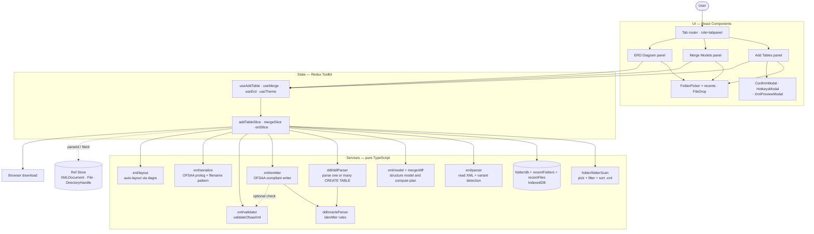

# Erwin Data Modeller — Lite: Architecture

## 1. Problem

Working with [erwin Data Modeler](https://www.erwin.com/products/erwin-data-modeler/) XML exports is heavier than it needs to be for everyday tasks:

- **Licence + install friction.** Just to add a table or look at an ER diagram, a teammate needs the full erwin desktop app, a paid licence, and a Windows machine.
- **OFSAA upload failures.** The OFSAA Data Model uploader is strict about XML structure. Models edited by hand or by ad-hoc scripts often fail with `ORA-00904: invalid identifier` or — worse — load silently with missing tables.
- **No quick "look-and-pick" workflow.** Comparing two model versions, picking which new tables/columns to copy across, or grabbing the latest model from a shared folder all required a full round-trip through the desktop tool.
- **No model visualisation outside erwin.** Understanding an unfamiliar model meant either opening it in erwin or reading raw XML.

## 2. Purpose

Build a small, browser-only tool that handles the **80% of erwin XML tasks** that don't need the full desktop app, and that produces XML the OFSAA uploader will accept on the first try.

Concrete outcomes:

- A reviewer can drop an XML file into a browser tab and see the model.
- An engineer can queue several new tables and export an OFSAA-compliant XML in one click.
- A modeller can merge two model versions through a visible, controllable diff.
- The output XML never has the structural defects that cause OFSAA `ORA-00904` errors.

## 3. Solution

### Legacy approach (what we replaced)

| Concern | Legacy state |
| --- | --- |
| Adding a table | Open erwin Data Modeler → make change → export XML → hope OFSAA accepts it |
| Looking at an ERD | Open erwin Data Modeler |
| Merging two models | Manual XML editing or erwin's own merge dialog |
| OFSAA compliance | Caught only at upload time, by an opaque error |
| Validating output | No deterministic check before upload |
| Sharing the tool | Each user needs an erwin install + licence |

### Current approach: Erwin Data Modeller — Lite

A single-page React app that runs entirely in the browser.

| Concern | Lite |
| --- | --- |
| Adding a table | A web form **or** paste one or many `CREATE TABLE` statements. Queue several tables, finalize, download a fresh XML — filename auto-versions (sequential, zero-padded, or ISO-date) |
| Re-opening recent work | IndexedDB-backed recent folders **and** recent files persist across reloads. Click to re-permission and re-load |
| Looking at an ERD | Drop the XML on the ERD tab. Auto-laid-out interactive diagram with search, minimap, and full keyboard pan/zoom |
| Merging two models | Two-slot drop zone, plan computed in memory, arrow-driven picker, executed against a fresh re-parse of the target. Validate the merged output before download |
| OFSAA compliance | Enforced in three layers: form-level checks, emitter rules, and a standalone validator. Run the validator from the UI as a dry-run with grouped, expandable violations |
| Validating output | `validateOfsaaXml(xml)` is a pure function. 10 unit tests cover the rule set; the in-app "Validate model" button surfaces the same result inline |
| Sharing the tool | Open a URL — no install, no licence, no upload to a third party |

### Why this approach was chosen

- **No backend.** The XML never leaves the user's browser. Easier deployment (any static host), no data-handling concerns, fast response.
- **No install for users.** Lowest possible friction for occasional contributors.
- **Deterministic, testable XML output.** Every OFSAA rule is enforced by code that is unit-tested. New rules become new tests, not tribal knowledge.
- **Layered architecture.** UI, state, and XML services are independent — the OFSAA emitter and validator are reusable from any other tool.
- **Cheap to extend.** Adding a fourth tab (e.g. a domain editor) is a self-contained slice + panel pair. No central registry to fight.

## 4. Architecture

### Diagram

### Components

- **UI (React).** Pure presentation. The three feature panels render Redux state and call hook actions. No XML or business logic lives here. Modals (`ConfirmModal`, `HotkeysModal`, `XmlPreviewModal`) and the Card primitive (with `collapsible` + `stepState` for ✓-progression) live alongside.
- **Feature hooks (`useAddTable`, `useMerge`, `useErd`, `useTheme`).** Thin wrappers around Redux selectors and dispatchers. Components import these instead of touching the store directly.
- **Slices (Redux Toolkit).** One per feature. Hold serializable state, expose actions and async "thunks" (functions that orchestrate side-effects like parsing or downloading). `addTableSlice` is the largest — it owns folder + recents, staging, finalization, bulk-DDL import, validation, preview, generate, and the success queue.
- **Services (pure TypeScript).** Framework-agnostic logic:
  - `folder/folderScan` — pick a directory, list files, sort newest-first.
  - `folder/db` + `folder/recentFolders` + `folder/recentFiles` — IndexedDB layer (single DB, two stores) so recent picks survive reloads.
  - `xml/parser` — turn a file into a parsed XML document.
  - `xml/model` and `merge/diff` — extract a structured model and compute what differs between two of them.
  - `xml/emitter` — write OFSAA-compliant XML for a new entity.
  - `xml/validator` — re-check serialized XML against the OFSAA rule set.
  - `xml/serialize` — canonical OFSAA prolog plus `generateNextFileName(name, pattern)` (sequential / zero-padded / ISO-date).
  - `ddl/ddlParser` — top-level Oracle DDL parser. `parseOracleDdl` for one statement, `parseOracleDdlMulti` for bulk paste; handles quoted identifiers, named PK constraints, and `CHAR`/`BYTE` size specifiers.
  - `ddl/oracleParser` — Oracle identifier and column-size rules.
  - `erd/layout` — turn entities + relationships into node positions and edge routes via the `dagre` library.
- **Ref store (`src/store/refs.ts`).** A small in-memory map for things Redux can't safely hold: the XML `Document` (mutated in place by the emitter), `File` objects from a folder pick, and the `DirectoryHandle` for the "Refresh folder" button.
- **Browser download.** Final XML is offered to the user via a generated `Blob` URL — no server is involved.

### How they interact (concrete example)

1. User picks a folder. The slice asks `folderScan` to list `.xml` files newest-first, stores the `File` objects in the ref store, and parses the latest one.
2. User queues two new tables in the form. Each one is validated and pushed to a `stagedTables` array in the slice.
3. User clicks **Finalize Model**. The slice flips an `isFinalized` flag; the form locks; **Generate XML** unlocks.
4. User clicks **Generate XML**. The slice retrieves the `Document` from the ref store, walks `stagedTables`, calls `emitter.addEntityDMv9` for each, then serializes and downloads the file.

## 5. Use Cases

- **Add several tables to a model and ship to OFSAA.** Pick the model folder, queue tables one at a time, finalize, download the augmented XML.
- **Bulk-import a schema from a dump.** Paste several semicolon-separated `CREATE TABLE` statements (including OFSAA-style quoted identifiers and named PK constraints) into the DDL textarea — every valid table lands in one click, with per-table errors surfaced for anything skipped.
- **Resume yesterday's session.** Recent folders **and** recent files are persisted to IndexedDB; click the file you were editing yesterday to re-open without re-picking the folder.
- **Merge a dev branch's model into prod.** Drop dev as source and prod as target, click Compute, move the new tables and columns into the staged pane, click Execute, validate the output, download the merged XML and report.
- **Spot-check an unfamiliar model.** Drop the XML into the ERD tab. Search for an entity by name, click into its column inspector, navigate the canvas with arrow keys, fit it back to the viewport with `0`.
- **Verify that a third-party pipeline produced OFSAA-valid XML.** Call `validateOfsaaXml(xml)` from a Node script or test — or click "Validate model" in the UI for the same rule set with grouped, expandable violations.
- **Always work against the latest export.** Use the preferred-folder picker so the latest `.xml` file is auto-selected on each visit.
- **Catch reserved-word column names before upload.** Typing `SELECT` as a column name fails at form submit, not at OFSAA upload time.

## 6. Weaknesses & Limitations

- **Staged-table state is still per-tab.** Recent folders and recent files persist via IndexedDB, but the in-progress staged-tables queue, finalization flag, and form draft do not. Closing the tab mid-session loses unsaved staging work; a `beforeunload` guard warns the user but doesn't recover the queue.
- **In-memory only.** Very large XMLs (hundreds of MB) may slow the browser since the whole `Document` lives in memory and SVG rendering keeps every entity in the DOM.
- **DM v9 only for advanced features.** Merge and ERD require the `erwin-dm-v9` schema. Classic erwin XML can only use the basic Add Tables flow.
- **No drag-to-reposition in the ERD.** Layout is fully automatic via `dagre`; users can't tweak positions or save a custom view.
- **No undo / redo.** Deleting a staged table or unfinalizing the model is one-way (a confirm modal guards destructive ops, but post-confirm there's no rewind).
- **Subject area / description is UI-only.** The optional description field is shown in the staged-tables list but never written to the XML.
- **Refresh-without-reprompt is Chrome/Edge only.** Firefox and Safari fall back to an HTML directory input that can't be re-iterated; users have to re-pick the folder to refresh.
- **`
` smooth animation is Chrome/Edge/Safari only.** Firefox and any browser without `::details-content` fall back to the snap behaviour — visual only, no functional regression.
- **Single-user.** No live collaboration, no shared model registry, no comments or review trails.
- **Validator runs on demand, not in CI.** The OFSAA validator is callable from tests and the in-app "Validate model" button, but isn't wired into a pre-commit or pre-deploy gate by default.
- **No backend means no integrations.** Cannot push to a model repository, post a Slack notification, or pull from a versioned model store.

## 7. Future Improvements

Items already shipped this iteration are marked **✅**; the rest remain on the roadmap.

- **Persistence.**
  - ✅ Remember recent folders and files via IndexedDB (FS Access API handles are structured-cloneable).
  - Auto-save the staged-tables queue, finalization flag, and form draft to local storage; restore on reopen.
- **Performance.**
  - Move XML parsing and validation off the main thread into a Web Worker so very large models stay responsive.
  - Virtualise SVG entities outside the viewport once a model exceeds ~500 entities.
- **ERD usability.**
  - ✅ Search-and-dim by entity name.
  - ✅ Click an entity to inspect its full column list.
  - ✅ Minimap with draggable viewport rectangle.
  - ✅ Full keyboard pan / zoom / fit.
  - Manual repositioning of entities with persisted positions.
  - "Focus on entity" mode that hides unrelated tables.
  - Export the diagram as PNG / SVG.
- **Emission gaps.**
  - ✅ Configurable filename pattern (sequential / zero-padded / ISO-date).
  - Write the description field into a real `EMX:Subject_Area` element (or as a comment) so it survives a round-trip back to erwin.
  - Support emission of foreign-key relationships, not just entity blocks.
  - Round-trip DDL export — generate `CREATE TABLE` for each staged table.
- **Validation surface.**
  - ✅ "Validate model" button surfaces the OFSAA validator in the UI with grouped, expandable violations.
  - ✅ "Preview XML" modal shows the would-be output without committing to a download.
  - On-edit (debounced) validation as the user types.
  - A CLI wrapper around `validateOfsaaXml` so it can run in CI against build artifacts from other tools.
- **Workflow features.**
  - ✅ Bulk DDL import — paste many `CREATE TABLE` statements at once with per-table validation.
  - ✅ Reset session and form-level reset.
  - Undo / redo for staging actions.
  - Multi-select for staged tables (bulk delete).
  - Per-table edit history visible in the staged-tables card.
  - Side-by-side diff of the generated XML against the source.
  - Command palette (`Cmd+K`) for entity / tab / action search.
  - Domain picker on the column form.
- **Reach.**
  - Backend-optional mode: optionally save sessions to a small server so a team can pick up where another teammate left off.
  - Full classic-erwin support in Merge and ERD, not just DM v9.
